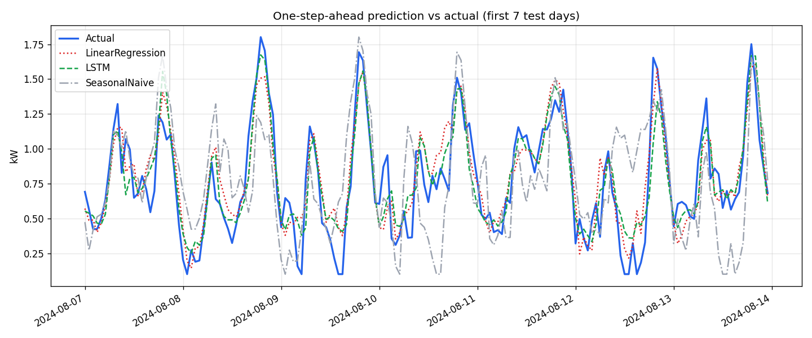

# ⚡ Smart Energy Consumption Predictor

> Hourly household-energy forecasting with **Ridge regression** and a **stacked LSTM**, benchmarked against naive baselines, with multi-step forecasts, back-tested prediction intervals, anomaly detection, rule-based saving tips and a Flask + Chart.js dashboard.


---

## Contents
1. [What it does](#what-it-does)
2. [Results](#results)
3. [Methodology](#methodology)
4. [Project structure](#project-structure)
5. [Quick start](#quick-start)
6. [API reference](#api-reference)
7. [Tests](#tests)
8. [Deployment](#deployment)
9. [Limitations](#limitations)

---

## What it does

| Component | Description |
|---|---|
| **Forecasting** | Predicts hourly consumption (kW) up to **72 h ahead** by recursive multi-step forecasting with either model |
| **Models** | Ridge regression (α tuned by time-series CV) and a 2-layer LSTM, plus *Persistence* and *Seasonal-naive* baselines |
| **Intervals** | ≈95 % prediction band = forecast ± 1.96 × back-tested RMSE at that horizon (not a fixed percentage) |
| **Anomaly detection** | Z-score, IQR, rolling z-score, Isolation Forest |
| **Suggestions** | Transparent rule-based tips; each states whether its saving figure is `computed` or a `heuristic` |
| **Dashboard** | Real history, forecast with band, predicted-vs-actual replay, metrics comparison |

---

## Results

Held-out **test period** (last 20 % of the timeline: 2024-08-07 → 2024-12-31, 3 504 hours), one-step-ahead, in **kW**.
Produced by `python scripts/train_models.py` on the **synthetic dataset** (seed 42) and stored in `models/saved/metrics.json`.

| Model | MAE | RMSE | R² | MAPE % | RMSE gain vs persistence |
|---|---|---|---|---|---|
| LSTM | 0.163 | 0.251 | 0.796 | 22.0 | 33.8 % |
| LinearRegression | 0.179 | 0.270 | 0.764 | 23.9 | 28.8 % |
| Persistence | 0.259 | 0.379 | 0.536 | 30.3 | — |
| SeasonalNaive | 0.315 | 0.437 | 0.385 | 42.7 | -15.1 % |

Multi-step back-test (recursive forecasts from 30 origins in the test period, RMSE in kW):

| Model | 1 h ahead | 24 h ahead | 72 h ahead |
|---|---|---|---|
| LSTM | 0.214 | 0.183 | 0.283 |
| LinearRegression | 0.219 | 0.210 | 0.322 |
| Persistence | 0.323 | 0.261 | 0.449 |



**Reading the results honestly**
* Both learned models clearly beat the naive baselines; the LSTM is modestly better than Ridge (RMSE 0.251 vs 0.270 kW).
* The data is **synthetic** (smooth daily/weekly patterns + autocorrelated noise), so this demonstrates that the *pipeline* works; it is not evidence about real homes. Run `python scripts/train_models.py --real` to get headline numbers on the UCI dataset and update this table.
* Seasonal-naive is *worse* than persistence at 1 h because it ignores the most recent hour; it becomes competitive only at day-long horizons.

---

## Methodology

**Target** – hourly mean of `Global_active_power` (kW).

**Features (10, all computable at forecast time)** – target history; `hour_sin/cos`; `day_of_week`, `is_weekend`, `month`; `rolling_mean_24h`, `rolling_std_24h`; `lag_24h`, `lag_168h`.
Same-time electrical measurements (voltage, current, sub-metering, reactive power) are deliberately **not** used: they are unknown at forecast time, `Global_intensity` is almost a deterministic function of active power, and excluding them is what makes true multi-step forecasting possible.

**Leakage control**
* Strict chronological split (80 / 20), no shuffling.
* `MinMaxScaler` and the outlier-clipping bounds (Q1 − 4·IQR … Q3 + 4·IQR) are fitted on the **training period only**.
* A sample uses hours `[t-24, t)` to predict hour `t`; features at any row depend only on the past (unit-tested).
* Validation set for early stopping = last 15 % of the *training* windows; the test set is touched once.

**Models**
* *Ridge*: `StandardScaler → Ridge`, input = flattened 24 × 10 window; α chosen from `[0.01 … 1000]` with `TimeSeriesSplit(5)`.
* *LSTM*: `LSTM(128, return_sequences) → Dropout(0.2) → LSTM(64) → Dropout(0.2) → Dense(32, relu) → Dense(1)`; Huber loss, Adam (1e-3) with `ReduceLROnPlateau`, early stopping (patience 8, restore best weights); ≈123 k parameters.
* *Baselines*: Persistence (`ŷ_t = y_{t-1}`) and Seasonal-naive (`ŷ_t = y_{t-24}`).

**Multi-step forecasting** – the one-step model is rolled forward; each prediction is appended to the history, all features are rebuilt with the same function used in training, and the next step is predicted. Errors compound, so the API's intervals come from the measured RMSE at each horizon.

**Metrics** (all computed in kW after inverse-scaling)

| Metric | Formula | Meaning |
|---|---|---|
| MAE | mean(\|y − ŷ\|) | average absolute error |
| RMSE | √mean((y − ŷ)²) | penalises large errors |
| R² | 1 − SS_res / SS_tot | variance explained |
| MAPE | mean(\|y − ŷ\| / y) × 100 | relative error (target clipped ≥ 0.1 kW) |

**Dataset** – UCI *Individual household electric power consumption* (2006-12 → 2010-11, minute resolution; <https://archive.ics.uci.edu/dataset/235>). Minute data is averaged to hourly; gaps ≤ 6 h are interpolated, longer ones filled with the value 24 h earlier. A synthetic hourly generator (2 years) is provided for demos / CI.

**Anomaly detectors**

| Method | Strength | Weakness |
|---|---|---|
| Z-score | simple, fast | assumes normality; flags normal seasonal peaks |
| IQR fence | robust to outliers | global threshold |
| Rolling z-score | adapts to local level (uses the *preceding* window only) | window needs tuning |
| Isolation Forest | no distribution assumption | on a single feature it acts like a global threshold |

---

## Project structure

```
Smart-Energy-Prediction/
├── backend/app.py              # Flask REST API (uses the trained models)
├── frontend/                   # index.html, style.css, app.js (Chart.js)
├── models/
│   ├── data_loader.py          # load → hourly → clean → features → split → scale → windows
│   ├── linear_model.py         # Ridge + TimeSeriesSplit tuning
│   ├── lstm_model.py           # stacked LSTM (TensorFlow, imported lazily)
│   ├── forecaster.py           # recursive multi-step forecasting + horizon back-test
│   ├── anomaly_detector.py     # 4 detectors + rule-based suggestions
│   ├── metrics.py              # MAE / RMSE / R² / MAPE
│   └── saved/                  # linear_model.pkl, lstm_model.keras, scaler.pkl, metrics.json, meta.json
├── scripts/train_models.py     # train + evaluate + save everything
├── notebooks/energy_analysis.ipynb   # EDA → modelling → evaluation (outputs included)
├── tests/                      # pytest: data pipeline, leakage, detectors, API
├── data/processed_energy.csv   # hourly features used by the API as history
├── data/charts/                # training loss, prediction comparison, horizon error
├── requirements.txt            # full (training + notebook)
├── requirements-deploy.txt     # lean (serving only; LSTM falls back to Ridge)
├── Procfile, render.yaml
```

---

## Quick start

```bash
git clone <your-repo-url> && cd Smart-Energy-Prediction
python -m venv venv && source venv/bin/activate      # Windows: venv\Scripts\activate
pip install -r requirements.txt

# (optional) retrain – the repo already ships trained models for the synthetic data
python scripts/train_models.py                    # synthetic data, ~8 min on CPU
python scripts/train_models.py --real             # UCI data (auto-downloads, larger)
python scripts/train_models.py --no-lstm          # Ridge + baselines only, seconds

python backend/app.py                             # → http://localhost:5000
```

If you retrain with `--real`, the API serves the *real* history and metrics automatically (they are read from `models/saved/` and `data/processed_energy.csv`).

Production: `gunicorn backend.app:app --workers 2 --bind 0.0.0.0:5000 --timeout 120`

---

## API reference

All endpoints return JSON; errors look like `{"error": "...", "code": 400}`.

| Endpoint | Description |
|---|---|
| `GET /api/health` | status, which models are loaded, data source, training time |
| `POST /api/predict` | `{model: "linear"\|"lstm", n_steps: 1-72, past_usage?: [kW…]}` → `timestamps, predicted, confidence_lower/upper, model_used, note`. `past_usage` replaces the most recent hours of the stored history before forecasting. If the LSTM is unavailable the response says so (`model_used: "linear"`, `note`) |
| `POST /api/suggestions` | `{series?, timestamps?}` → tips + series stats (default: last 7 days) |
| `POST /api/anomalies` | `{series?, method, threshold}` → indices, values, count, %, severity |
| `GET /api/history?days=7` | real hourly kW from the processed dataset |
| `GET /api/model-metrics` | contents of `models/saved/metrics.json` (503 if not trained) |
| `POST /api/simulate` | `{step, model}` → replays the held-out test period: model prediction **and** the actual value for that hour |

Example:
```bash
curl -X POST localhost:5000/api/predict -H 'Content-Type: application/json' \
     -d '{"model":"lstm","n_steps":24}'
```

---

## Tests

```bash
pip install pytest
pytest -q          # 29 tests: no-leakage checks, flat-target regression test, all detectors, every API endpoint
```

---

## Deployment

**Render** – `render.yaml` uses `requirements-deploy.txt` (no TensorFlow → smaller, fits a small instance). The API then serves Ridge and reports a fallback note if "lstm" is requested. For the LSTM in production use an instance with ≥ 2 GB RAM and `pip install -r requirements.txt`.
`models/saved/*` and `data/processed_energy.csv` must be committed (they are small: ≈1.5 MB).

---

## Limitations

* Headline numbers are on **synthetic** data (see Results); retrain on UCI for real-world claims.
* One household, no weather / holiday / occupancy / tariff information.
* Prediction intervals assume the back-test error distribution is representative of the future.
* Saving percentages in the tips are indicative (`basis: "heuristic"`) unless marked `computed`.
* The dashboard's anomaly panel injects four demo spikes client-side into the history so there is something to detect.
* Recursive forecasting accumulates error; accuracy degrades with horizon (see back-test table).

---

MIT © 2024 – free for academic and personal use.
